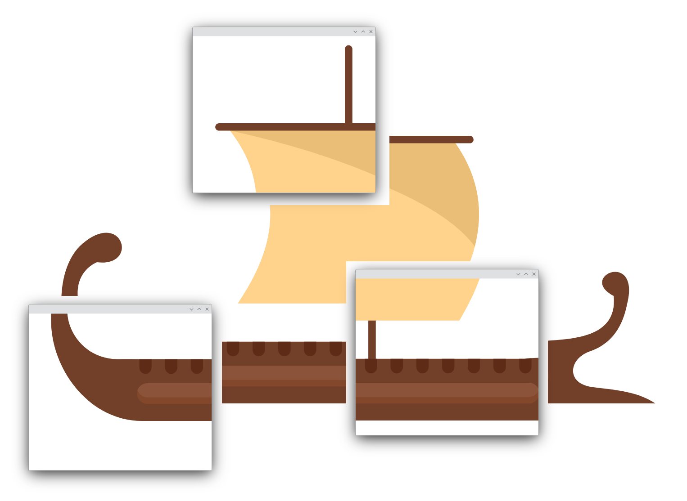
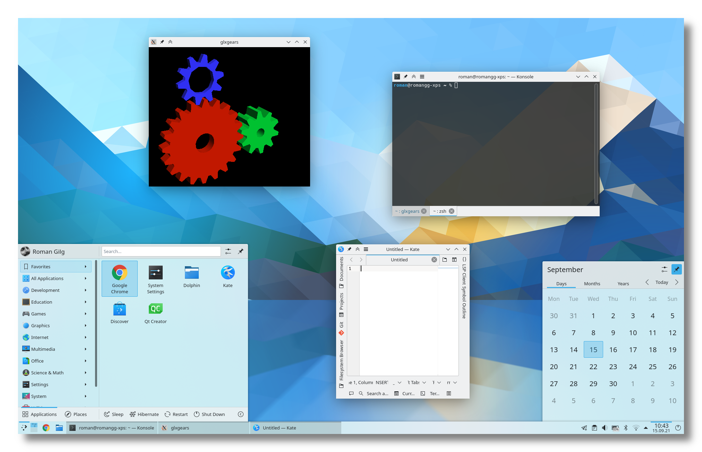

<!--
SPDX-FileCopyrightText: 2024 Roman Gilg <subdiff@gmail.com>

SPDX-License-Identifier: GPL-2.0-or-later
-->

  <picture>
    
  </picture>
  <h1>Theseus' Ship</h1>

Theseus' Ship is a robust, fast and versatile yet
easy to use composited window manager for the
[Wayland](https://wayland.freedesktop.org/) and
[X11](https://en.wikipedia.org/wiki/X_Window_System)
windowing systems on Linux.

  

    
  

Theseus' Ship is intended to be used as part of a
[KDE Plasma Desktop](https://kde.org/plasma-desktop/).
Theseus' Ship is a reboot of KDE's
[KWin](https://en.wikipedia.org/wiki/KWin).
Theseus' Ship differentates itself from KWin in that it uses [the Compositor Modules](https://github.com/winft/como).

## Installation
Theseus' Ship can be compiled from source.
If you do that manually you have to check for your specific distribution
how to best get the required dependencies.
You can also make use of the FDBuild tool to automate that process as described
[here](CONTRIBUTING.md#compiling).

## Usage
Theseus' Ship can be used as a drop-in replacement for KWin inside a KDE Plasma Desktop session.
After installation and a system restart the Theseus' Ship binary will execute.
All configuration, plugins and shell interaction transfer over.

## Development
The [CONTRIBUTING.md](CONTRIBUTING.md) document contains all information
on how to get started with:
* providing useful debug information,
* building Theseus' Ship
* and doing your first code submission to the project.
